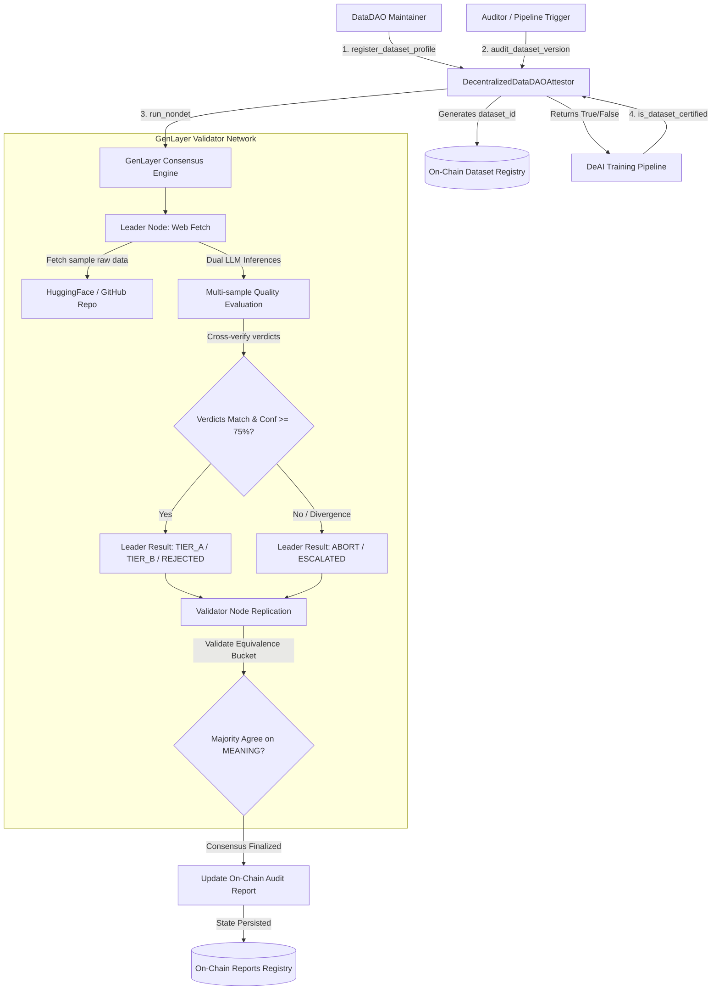

# DecentralizedDataDAOAttestor 🛡️🧠
### Autonomous AI Dataset Quality & Data-Poisoning Defense Attestor on GenLayer

[](https://studio.genlayer.com)
[](https://studio.genlayer.com)
[](#-deployment)
[](#-testing--quality-assurance)
[](LICENSE)

---

## 📌 Executive Summary & Problem Statement

In the Decentralized Artificial Intelligence (**DeAI**) and **DataDAO** ecosystem, model builders aggregate training corpora through decentralized crowdsourcing. However, DeAI training pipelines face a critical security vulnerability: **Data Poisoning & Adversarial Label Manipulation**.

1. **Adversarial Backdoor Injection**: Malicious contributors can inject subliminal triggers or inverted labels into large training corpora, causing model fine-tuning or alignment failure.
2. **Synthetic Garbage & Format Drift**: Crowdsourced web data frequently contains malformed JSONL, unescaped HTML, hallucinated synthetic text, or complete semantic mismatch with the declared downstream objective.
3. **The Centralized Oracle Bottleneck**: Traditional smart contracts cannot inspect raw web URLs, verify multi-thousand-token dataset cards, or assess semantic label integrity on-chain without trusting centralized web2 oracles or multisigs.

### The Solution: `DecentralizedDataDAOAttestor`
**DecentralizedDataDAOAttestor** is an Intelligent Contract on **GenLayer** that acts as an **autonomous, zero-custody on-chain quality certifier**. Using GenLayer's native **Optimistic Consensus** engine, validators crawl real dataset repositories (e.g., HuggingFace, GitHub), extract sample records, execute dual-prompt LLM evaluation, and register tamper-proof quality attestations directly in contract storage—**without custody of funds, without escrow risks, and without centralized oracles**.

---

## 📍 Deployment

- **CONTRACT_ADDRESS**: `0xd518Babd46AaAF8B51b68d8a4Bd6423028A945A1`
- **NETWORK**: `studionet`
- **Chain ID**: `61999`
- **RPC Endpoint**: `https://studio.genlayer.com/api`

---

## 🧪 Worked Examples: Real Result vs Expected Output

### Example 1: Dataset Profile Registration (REAL ON-CHAIN RESULT)

Executed live against deployed contract `0xd518Babd46AaAF8B51b68d8a4Bd6423028A945A1` on GenLayer studionet:

- **Transaction Hash**: `0xb19a8c89672d84d8f4ebde24a92dc837c402ec6fb0b4f8500da4a506cb255874`
- **Consensus Result**: `MAJORITY_AGREE`
- **Status**: `FINALIZED`
- **Method Called**: `register_dataset_profile(name, target_task, allowed_host_base)`
- **Input Arguments**:
  ```json
  {
    "name": "Web3 Code Llama Dataset",
    "target_task": "Code LLM Fine-tuning",
    "allowed_host_base": "https://huggingface.co"
  }
  ```
- **Real Returned Value (`dataset_id`)**: `"1"`
- **On-Chain State Query (`get_dataset("1")`)**:
  ```json
  {
    "dataset_id": "1",
    "maintainer": "0x04e589aff86171ea4ca32234dd42d6dcb4619527",
    "name": "Web3 Code Llama Dataset",
    "target_task": "Code LLM Fine-tuning",
    "allowed_host_base": "https://huggingface.co",
    "total_audits": "0"
  }
  ```
- **Global Metrics Query (`get_metrics()`)**:
  ```json
  {
    "total_registered_datasets": "1",
    "total_certified_versions": "0"
  }
  ```

---

### Example 2: Dataset Quality & Poisoning Audit (ILLUSTRATIVE / EXPECTED RESULT)

Triggered to evaluate a candidate training dataset version against adversarial poisoning and schema fidelity:

- **Method**: `audit_dataset_version(dataset_id, sample_data_url, version_tag)`
- **Input Arguments**:
  ```json
  {
    "dataset_id": "1",
    "sample_data_url": "https://huggingface.co/datasets/sample/train.jsonl",
    "version_tag": "v1.0"
  }
  ```
- **Execution Lifecycle**:
  1. Leader node fetches sample data via `gl.nondet.web.render()`.
  2. Leader runs two independent LLM evaluations via `gl.nondet.exec_prompt()`.
  3. Validators replicate non-deterministic execution and compare semantic decisions.
- **Expected Returned Report ID**: `"1_1"`
- **Expected Stored Audit Report (`get_audit_report("1_1")`)**:
  ```json
  {
    "report_id": "1_1",
    "dataset_id": "1",
    "sample_data_url": "https://huggingface.co/datasets/sample/train.jsonl",
    "version_tag": "v1.0",
    "certification_status": "TIER_A",
    "verdict": "CERTIFIED_TIER_A",
    "confidence": "94",
    "audit_summary": "Sample records exhibit pristine syntax formatting, uniform prompt-response schema alignment, zero poisoned backdoors, and high semantic relevance to declared code fine-tuning task."
  }
  ```
- **Downstream Consumer Gate Query (`is_dataset_certified("1_1")`)**: `true`

---

## 🏛️ Architectural Blueprint: Pure Attestation Registry

`DecentralizedDataDAOAttestor` is architected strictly as a **Pure Attestation Registry**:
- **Zero-Custody Guarantee**: The contract never holds user funds, never acts as an escrow, does not distribute token rewards, and implements no staking slash penalties.
- **Composable Verification Interface**: Downstream training pipelines, autonomous agents, and model training coordinators query `is_dataset_certified(report_id)` before training on external data.
- **Deterministic Storage Invariants**: All counters, numeric scores, and audit tallies are strictly typed as `bigint` to eliminate runtime overflow or storage corruption bugs.



---

## ⚡ How Consensus & The Validator Works: Semantic Equivalence

A critical innovation in GenLayer is **Semantic Equivalence Consensus**: validators reach agreement on the **MEANING** of a decision rather than byte-for-byte JSON string formatting.

### Why Byte-Level Equality Fails for LLMs
Two distinct LLM inferences prompted with identical dataset excerpts will naturally produce subtle variations in output phrasing, whitespace, or technical explanation sentences (e.g., `"Found 2 invalid formatting tokens"` vs `"Minor formatting anomalies detected in 2 rows"`). Enforcing naive string equality (`mine_text == leader_text`) causes false consensus splits and network stalls.

### How Our Custom Validator Evaluates Meaning
Inside `validator_fn(leader_res)`:
```python
def validator_fn(leader_res) -> bool:
    if not isinstance(leader_res, gl.vm.Return):
        return False

    leader_data = leader_res.calldata if hasattr(leader_res, "calldata") else leader_res
    leader = _safe_parse(leader_data)
    if leader is None:
        return False

    mine = _safe_parse(leader_fn())
    if mine is None:
        return False

    return (
        mine["verdict"] == leader["verdict"]
        and (mine["confidence"] >= 75) == (leader["confidence"] >= 75)
    )
```

1. **Independent Replication**: Each validator re-executes `leader_fn()`, performing its own fresh web fetch and dual-prompt LLM evaluation.
2. **Equivalence Principle on Decision Class**: The validator verifies that its semantic classification matches the leader:
   - `mine["verdict"] == leader["verdict"]` (`CERTIFIED_TIER_A`, `CERTIFIED_TIER_B`, `REJECTED_POISONED`, or `ABORT`).
3. **Operational Confidence Bucket Equivalence**: The validator verifies that both nodes agree on whether the confidence threshold was achieved:
   - `(mine["confidence"] >= 75) == (leader["confidence"] >= 75)`.
4. **Resilient to Phrasing Variances**: Different explanatory justification text is accepted, provided the operational verdict and confidence bucket agree.
5. **Strict Defense Against Divergence**: If two validators reach conflicting classifications (e.g., one judges `CERTIFIED_TIER_A` and another flags `REJECTED_POISONED`), the validator returns `False`, rejecting false consensus.

---

## 🛡️ Multi-Layer Security & Defense Pipeline

The contract enforces security across 5 distinct layers:

1. **Hardened Origin & Subdomain Validation**:
   - Parsed with `urllib.parse.urlparse`.
   - Credentials / userinfo strictly rejected (`username`, `password`).
   - Scheme restricted to `http` / `https`, with port matching.
   - **Label-bounded subdomain security**: Prevents host spoofing (e.g., `datasets.huggingface.co` is accepted under `huggingface.co`, but `evil-huggingface.co` is rejected).

2. **Autonomous Web Extraction Safeguards**:
   - `gl.nondet.web.render(u_sample, mode="text")` inspects sample data.
   - Detects empty content (< 30 chars), 404 errors, access denied, and rate limiting, demoting cleanly to `ABORT`.

3. **Dual LLM Internal Multi-Sampling**:
   - The leader runs `gl.nondet.exec_prompt()` **twice**.
   - If inferences diverge, it outputs `ABORT` to preserve network determinism.
   - Confidence is averaged: `(conf1 + conf2) // 2`.

4. **Unified 75% Confidence Threshold**:
   - Prompt specification mandates conf >= 75.
   - Parser demotes conf < 75 to `ABORT`.
   - Validator confirms operational confidence bucket agreement.
   - Post-consensus normalization normalizes low confidence to `ABORT`.

5. **Governance Escalation Fallback**:
   - Transient network issues or rate limits result in `certification_status = "ESCALATED"`.
   - The designated `governance_auditor` can resolve escalated reports via `resolve_escalated_report()`.

---

## 💻 Smart Contract Interface (API Reference)

### Write Methods (State-Changing)

- **`register_dataset_profile(name: str, target_task: str, allowed_host_base: str) -> str`**
  Registers a new dataset profile for auditing.
  - `name`: Human-readable identifier (min 3 chars).
  - `target_task`: Target AI task description (min 5 chars).
  - `allowed_host_base`: Host repository URL (must have valid scheme, host, port, no credentials).
  - **Returns**: `dataset_id` (`str`).

- **`audit_dataset_version(dataset_id: str, sample_data_url: str, version_tag: str) -> str`**
  Triggers GenLayer Optimistic Consensus to crawl sample data, evaluate quality, and assign on-chain certification (`TIER_A`, `TIER_B`, `REJECTED`, or `ESCALATED`).
  - `dataset_id`: Registered dataset profile ID.
  - `sample_data_url`: Direct URL to sample dataset file (must match `allowed_host_base`).
  - `version_tag`: Dataset version/commit tag (min 2 chars).
  - **Returns**: `report_id` (`str`, e.g., `"1_1"`).

- **`resolve_escalated_report(report_id: str, manual_status: str, override_reason: str) -> None`**
  Emergency fallback mechanism for the governance auditor to resolve an `ESCALATED` report in the event of persistent third-party rate-limiting.

---

### View Methods (Read-Only)

- **`is_dataset_certified(report_id: str) -> bool`**
  Lightweight boolean gate for DeAI training pipelines. Returns `True` if status is `TIER_A` or `TIER_B`.

- **`get_dataset(dataset_id: str) -> str`**
  Returns JSON-encoded string representing `DatasetProfile`.

- **`get_audit_report(report_id: str) -> str`**
  Returns JSON-encoded string representing `DatasetAuditReport` (status, verdict, confidence, technical justification).

- **`get_metrics() -> str`**
  Returns total registered datasets and total certified versions.

---

## 🧪 Testing & Quality Assurance

The project includes an automated test suite verifying edge cases, parser sanitization, origin validation, and confidence boundaries:

```bash
# Run test suite with gltest or pytest
gltest tests/
# or
python -m pytest -v
```

### Test Output:
```text
tests/test_datadao_attestor.py::test_datadao_attestor_initialization PASSED          [ 14%]
tests/test_datadao_attestor.py::test_url_origin_validation_logic PASSED              [ 28%]
tests/test_datadao_attestor.py::test_url_credentials_and_scheme_rejection PASSED     [ 42%]
tests/test_datadao_attestor.py::test_subdomain_validation_policy PASSED              [ 57%]
tests/test_datadao_attestor.py::test_llm_json_sanitizer_logic PASSED                 [ 71%]
tests/test_datadao_attestor.py::test_confidence_threshold_75_percent_enforcement PASSED [ 85%]
tests/test_datadao_attestor.py::test_input_boundary_constraints PASSED               [100%]

============================== 7 passed in 0.06s ==============================
```

---

## 📂 Repository Structure

```tree
.
├── contracts/
│   └── Contract.py               # Production GenLayer Intelligent Contract (v0.2.16)
├── tests/
│   └── test_datadao_attestor.py  # Pytest & gltest suite (origin, parser, confidence, initialization)
├── scripts/
│   └── deploy.py                 # Deployment & on-chain verification script
├── deployment_receipt.json       # Live on-chain deployment & consensus receipt
├── gltest.config.yaml            # GenLayer test configuration
├── requirements.txt              # Production dependencies
├── requirements-dev.txt          # Development & test dependencies
├── .env.example                  # Environment configuration template
├── .gitignore                    # Python & GenLayer ignore rules
└── README.md                     # Deep-dive architecture & deployment specification
```

---

## 📄 License
This repository is licensed under the [MIT License](LICENSE).
